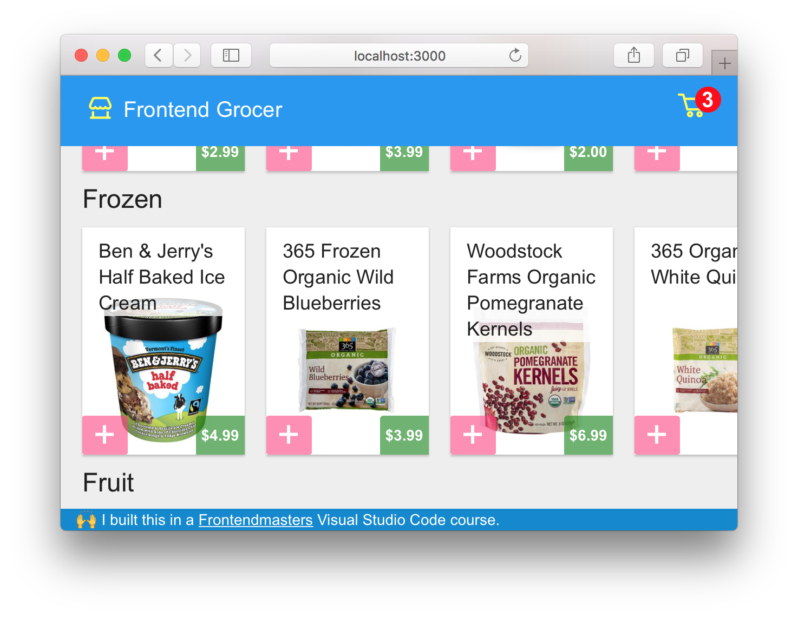

# Using Visual Studio Code

* 📄 [Awesome Documents](./markdown.md)
* ⏩ [Emmet](./emmet.md)
* 🎛 [Refactoring](./refactoring.md)
* ✅ [Type-Checking](./type-checking.md)
* 🐞 [Debugging](./debugging.md)

---

## The best way to get to know this editor...

 Let's use it to do some stuff!

 Here's the example we will be working with - a grocery app! 
 It's a client/server app, built with bleeding edge versions of the following:
   - [React 16 (beta)](https://github.com/facebook/react/issues/10294)
   - [Webpack 3](https://webpack.js.org/)
   - [TypeScript 2.5](https://blogs.msdn.microsoft.com/typescript/2017/08/31/announcing-typescript-2-5/)
   - [Koa](http://koajs.com/)


 This is intended to show you the most modern web tools🔧 available. 95% of this can be done in older versions too!

 <br> <br> <br> <br>

 Take a moment now to ensure you're all set up.
   First, make sure you're running a recent version of Node.js
   ```sh
   node --version # v8.0.0 or newer
   ```
   And we need a library called sqlite3 for our database. You can check your version by running
   ```sh
   # If you don't have it yet
   brew install sqlite3
   # If you already have it
   sqlite3 --version # 3.16.0 2016-11-04...
   ```
   And it's helpful to have a package manager called yarn
   ```sh
   # If you don't have it yet
   brew install yarn
   # If you already have it
   yarn --version # 0.27.5
   ```
   ```sh
   git clone https://github.com/mike-north/vscode-fundamentals vscode
   cd vscode
   yarn
   npm start
   # Open http://localhost:3000
   ```

NEXT: 📄 [Awesome Documents](./markdown.md)