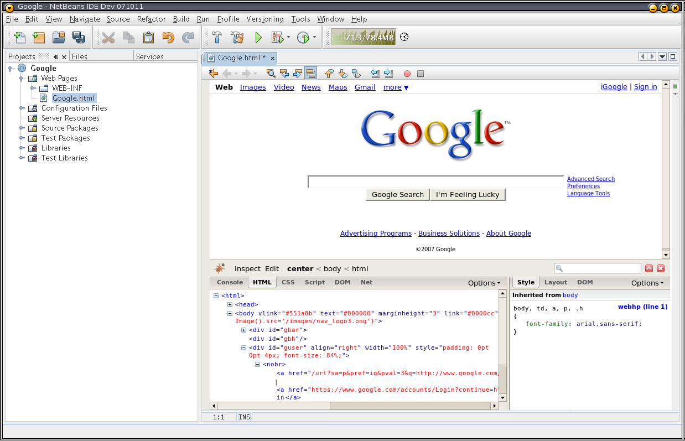
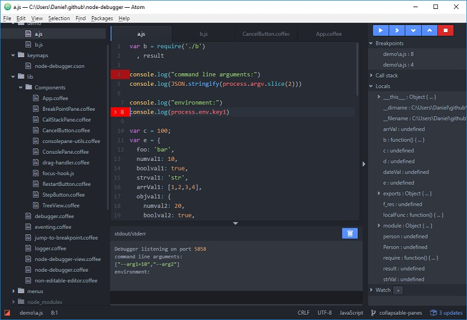

# Using Visual Studio Code

* 📄 [Awesome Documents](./markdown.md)
* ⏩ [Emmet](./emmet.md)
* 🎛 [Refactoring](./refactoring.md)
* ✅ [Type-Checking](./type-checking.md)
* 🐞 **Debugging**

---

## Debugging Node

Node has no GUI, so the built-in debugging experience is 🤢 (vomoticon). Let's take a look!

```sh
npm run debug
```

Thankfully, in [May 2016](https://www.youtube.com/watch?v=x8u0n4dT-WI&feature=youtu.be&t=2571) we got a new flag that basically
  - 🛑 Suspends global node.js execution on the first line of code
  - 🔗 Gives us a URL to open w/ chrome

```sh
npm run debug:attach
```
Under the hood, this runs `node --inspect --inspect-brk`.

<br><br><br><br>

## Debugging Node w/ Editors

 This still involves a ton of context switching
  - 👎 Yes, this is a bad thing
  - 🔫 Multitasking stockholm syndrome
  - 🐟 Seems like we've been floundering around for a decade trying to get this right




👆 this one was/is actually really cool, but...
  - insanely hard to set up
  - and brittle,
  - and looks like it works
  - but it doesn't really

There are some [community sourced Atom plugins](https://atom.io/packages/node-debugger)



But these plugins are complex and need a HUGE amount of effort to get right
  - sourcemaps
  - advanced debugging features
  - asynchrony
  - multiple threads
  - multiple debugging sessions

<br><br><br><br>

### Debugging Node w/ VS Code

1. Start node with the same `--inspect` and `--inspect-brk` flags
```
npm run debug:inspect
```
2. Open the **Debugger** side panel
3. Create a new "launch configuration" that looks like this

```js
{
  "type": "node",
  "request": "attach",
  "name": "Attach",
  "sourceMaps": true,
  "port": 9229,
  "protocol": "inspector"
}
```

4. Now press the <kbd>Launch ▶️</kbd> button to attach to the Node runtime
* Inspector vs Legacy Protocol
* Launch vs. Attach
* Conditional breakpoints
* Restart Frame
* Column Breakpoints
* Skipping Code

<br><br><br><br>

### Debugging Chrome w/ VS Code

We just need another launch configuration.
```js
{
  "type": "chrome",
  "request": "launch",
  "name": "Launch Chrome",
  "url": "http://localhost:3000",
  "webRoot": "${workspaceRoot}"
}
```
We can launch this at the same time as our node debugger

<br><br><br><br>

# Exercise 4: Multi-Process Debugging
> * Try adding something to the cart. There's a suble bug involving a misunderstanding between client & server about > data format
> * Set a breakpoint in [/client/data/cart-store.js](/client/data/cart-store.js#_saveCart)'s `_saveCart()` function right before the `PUT` request is sent
> * Set a breakpoint in [/server/routes/cart.js](/server/routes/cart.js)'s `.put("/items")` handler, keeping an eye on the body of the HTTP request as it lands
> * Use the above guidelines to create "attach" launch configurations for both Chrome and Node
> * Find and fix the problem
> * You should be able to (almost) step from one breakpoint to the other

---

NEXT: 🎨 [Workspace Customization](../2_customizing/workspace.md)