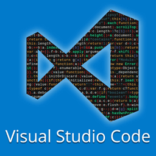
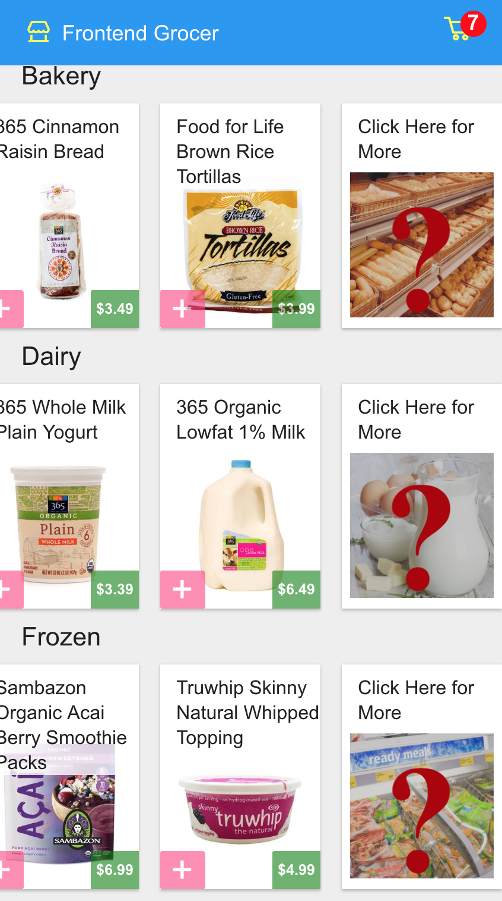

# Using Visual Studio Code

* 📄 [Awesome Documents](./markdown.md)
* ⏩ **Emmet**
* 🎛 [Refactoring](./refactoring.md)
* ✅ [Type-Checking](./type-checking.md)
* 🐞 [Debugging](./debugging.md)

---

## Emmet Autocompletions

* Speed up repetitive tasks with `TAB`
* Plugins for most editors
* Built into VS Code
* Works in JSX

<br><br><br><br>

### Emmet: HTML Elements
* Think of as CSS selectors for DOM generation
* Cursor usually ends up placed just where you want it to be next

##### `div`
```html
<div></div>
```

##### `.foo`
```html
<div class="foo"></div>
```

<br><br><br><br>

##### `span.foo#bar`
```html
<span class="foo" id="bar"></span>
```

##### `img`
```html

```

<br><br><br><br>

### Nesting & Sibling
* Just like in CSS, we can use...

| Selector | Description |
|-----|------|
| `>` | Direct decendant selector |
| `+` | Sibling selector |

##### `ul>li.special-item`
```html
<ul>
  <li class="special-item"></li>
</ul>
```

##### `.navbar+.content+.footer`
```html
<div class="navbar"></div>
<div class="content"></div>
<div class="footer"></div>
```

We can also use the "climb up" operator: `^`

##### `div+div>p>span+em^bq`
```html
<div></div>
<div>
  <p><span></span><em></em></p>
  <blockquote></blockquote>
</div>
```

Personally, I prefer using parentheses (grouping) rather than climb-up

##### `div+div>(p>(span+em))+bq`
```html
<div></div>
<div>
  <p><span></span><em></em></p>
  <blockquote></blockquote>
</div>
```

There's a feature called "multiplication" that's useful for lists

##### `ul.col>li.col-item*5`
```html
<ul class="col">
  <li class="col-item"></li>
  <li class="col-item"></li>
  <li class="col-item"></li>
  <li class="col-item"></li>
  <li class="col-item"></li>
</ul>
```

And you can even add text to the body of elements, with a placeholder for number in the list

##### `ul.col>li.col-item*5{Item $}`
```html
<ul class="col">
  <li class="col-item">Item 1</li>
  <li class="col-item">Item 2</li>
  <li class="col-item">Item 3</li>
  <li class="col-item">Item 4</li>
  <li class="col-item">Item 5</li>
</ul>
```

<br><br><br><br>

### Emmet: Styles
* Lots of different combinations (too many to remember)
* Value aliases are pretty easy to get used to

| Alias | Value |
|-------|-------|
| `p`   | Percent |
| `e`   | em |
| `r`   | rem |
| `px`   | px |

* Rule of thumb: first letter of each word for a property

| Emmet | Evaluates to |
|-------|-------|
| `w100p!`   | `width: 100% !important` |
| `lh1.5r`   | `line-height: 1.5rem` |
| `o50p`   | `opacity: 50%` |

<br><br><br><br>

### Tips for Productive Emmet Use
* No newlines or spaces
* You can create custom shortcuts (more on this later)
* Aim for several small expansions, rather than one huge expansion
* Start basic, and add new shortcuts over time

<br><br><br><br>

# Exercise 1: Rapid Expansion


>  * We want to add a new tile to the right of each category row, as shown here 👉
>  * You'll need to edit the `render` function in [client/routes/home/category-row/index.tsx](../../client/routes/home/category-row/index.tsx)
>  * There's a per-category image you can use, which take the form `/images/fallback-<lowercase-category-name>.png`. (i.e., [http://localhost:3000/images/fallback-frozen.png](http://localhost:3000/images/fallback-frozen.png))
> * Use Emmet autocompletions to build the appropriate HTML structure
> ```html
> <li class="GroceryItem mui-panel">
>   <h4 class="item-name">
>     Click Here for More
>   </h4>
>   <span class="click-for-more">              
>     
>   </span>
> </li>
> ```
> * ⚠️ React likes `className=` not `class=`
> * ⚠️ You interpolate dynamic and static values in JSX like this
> ````js
> 
> ````

---
NEXT: 🎛 [Refactoring](./refactoring.md)