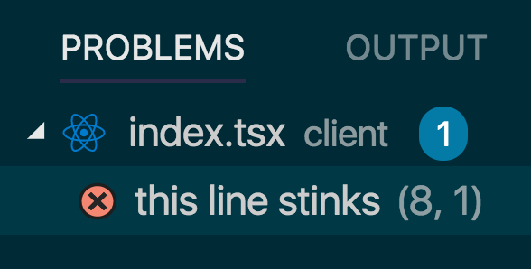
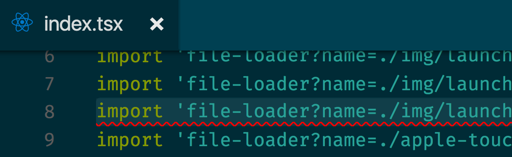

## Customizing Visual Studio Code

* 🎨 [Workspace Customization](./workspace.md)
* ☑️ **Tasks**
* 🚀 [Launch Configuration](./launch-configuration.md)

---


## About Tasks

* Run build steps, linting, testing, deploying scripts from within VS Code
* Anything in a `Gruntfile`, `Gulpfile`, [`package.json`](../../package.json) ("scripts") should be auto-detected
* Where's the best place for these files to live?
  * Main stuff: `package.json` or [Scripty](https://github.com/testdouble/scripty)
  * VS Code specifics layered on top
* Ability to parse "problems" from output, linking to file and line number

<br><br><br><br>

## Custom tasks in [tasks.json](../../.vscode/tasks.json)
* Define one or more things in the `tasks` array
* Basic Example of a `"type": "shell"` task
```js
{
  "version": "2.0.0",
  "tasks": [
    {
      "taskName": "echo",
      "type": "shell",
      "command": "echo Hello"
    }
  ]
}
```

<br><br>

## Tasks: Shell Command Arguments

* It's best to use the `"args"` property to ensure arguments are properly quoted

```js
{
  "taskName": "echo",
  "type": "shell",
  "command": "echo",
  "args": [
    "I said, 'Hello world'"
  ]
}
```
<br><br>

* We can add a working directory option as well, to ensure this runs at our project root folder

```js
{
  "taskName": "echo",
  "type": "shell",
  "command": "echo",
  "args": [
    "I said, 'Hello world'"
  ],
  "options": {
    "cwd": "${workspaceRoot}"
  }
}
```
<br><br>

## Tasks: Capturing output into "problems"

* If the output of this command printed indications of problems in our code (at a particular file/line), we can use <kbd>Command</kbd> + Click 🖲 on a file path to open that file

```js
  "taskName": "echo",
  "type": "shell",
  "command": "echo",
  "args": [
    "client/index.tsx,LINE:8,this line stinks"
  ],
  "options": {
    "cwd": "${workspaceRoot}"
  },
```

<br><br>

* But what about pointing out problems by line/column?

This task would output something like this:
```ruby
client/index.tsx,LINE:8,this line stinks
```
What we need is a regular expression with [capture groups](http://www.regular-expressions.info/refcapture.html)
* https://regex101.com/
* http://regexr.com/

**Cheat sheet**
```
[0-9]        any number
[w]+         1 or more "w" characters
[w]*         0 or more "w" characters
[\s\w]+      1 or more "word" or "space"
LINE:([0-9]+)  grab digits after "LINE:"
```
**EXAMPLE:**
If our string is `LINE:31`, and we use a regex:
```
LINE:([0-9]+)
```
* Group 0: "LINE:31"
* Group 1: "31"

<h2 style='color: limegreen' align=center>Let's figure out the appropriate regex!</h2>

<br><br><br><br>

Once we have this, we can use it within our task to detect the files, line #s, and specific details for any problems that are found:

```js
{
  "taskName": "echo",
  "type": "shell",
  "command": "echo",
  "problemMatcher": {
    "owner": "ts",
    "pattern": {
      "regexp": `<the regex>`,
      "file": 1,
      "line": 2,
      "message": 3
    }
  }
}
```
And we should see the following in our "problems" tab
<p align=center>

</p>
and clicking on the problem should take us right to the appropriate line in the appropriate file
<p align=center>

</p>

<br><br><br><br>

# Exercise 6: TSLint Problems
> * Think of it as "ESLint for TypeScript"
> * You can run this via `./node_modules/.bin/tslint --project <root of your workspace>`
> * <details><summary>click for sample output</summary><pre>ERROR: /Users/northm/Development/workshops/vscode/client/components/app-header/index.tsx[22, 7]: Identifier 'cartIcon' is never reassigned; use 'const' instead of 'let'.</pre></details>
> 1. Create a custom task to run TSLint
> 2. Define a regex-based Problem Matcher to capture output, so that any issues found are shown in the "problems" panel
> 3. Fix all the bugs it points out (Cycle through problems w/ `F8`)

---

NEXT: 🚀 [Launch Configuration](./launch-configuration.md)